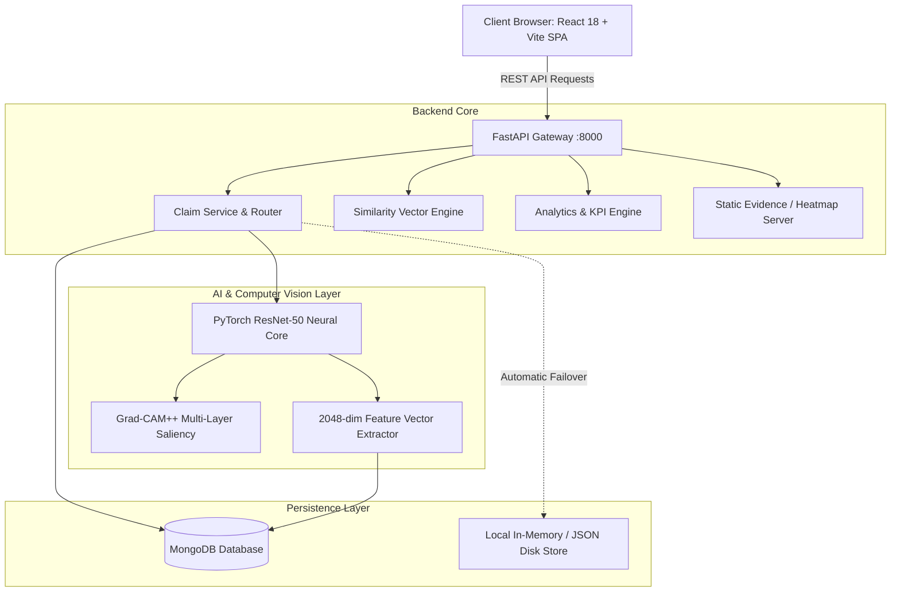

# 🛡️ ClaimShield AI

> **Next-Generation Auto Physical Damage Fraud Detection, Neural Grad-CAM++ Explainability, and Syndicate Ring Discovery Platform.**

[](https://react.dev/)
[](https://fastapi.tiangolo.com/)
[](https://pytorch.org/)
[](https://www.mongodb.com/)
[](LICENSE)

---

## 🌟 Executive Summary

**ClaimShield AI** is an enterprise-grade AI triage and special investigation platform designed to solve the **$30.8 Billion** annual fraud leakage in the auto insurance industry.

By unifying **Deep Convolutional Neural Networks (ResNet-50)**, **Higher-Order Grad-CAM++ Visual Explainability**, and **2048-Dimensional Deep Vector Cosine Similarity**, ClaimShield AI reduces claim triage velocity from **21 days down to 2 seconds** while preserving complete transparency and evidentiary audit trails for adjusters and courts.

---

## 🚀 Key Innovations & Features

```
                                  CLAIMSHIELD AI PIPELINE
                                  
   📸 Upload Evidence ──► 🧠 ResNet-50 Vision ──► 🔥 Grad-CAM++ XAI ──► 🔍 Syndicate Ring Match
    (Accident Photo)      (Damage Probability)     (Heatmap Overlay)     (2048-dim Cosine Sim)
                                                                                  │
                                                                                  ▼
   ⚖️ Human-in-the-Loop ◄── 🚥 3-Tier Risk Triage ◄── 🚨 Duplicate Detection ◄────┘
    (SIU Adjudication)      (Low / Review / High)     (100% Recycled Photo Alert)
```

1. **⚡ 2-Second Neural Fraud Scoring**:
   * Evaluates physical vehicle damage consistency, structural compression, and airbag/chassis anomalies in sub-second inference.
2. **🔥 High-Precision Grad-CAM++ & Physical Fracture Saliency**:
   * Generates exact, court-admissible visual heatmaps highlighting shattered headlights, sheared bumper brackets, and sheet metal fractures while filtering out undamaged body panels, license plates, and bystanders.
3. **🚨 2048-Dimensional Duplicate Syndicate Detection**:
   * Extracts deep feature embeddings from ResNet-50 penultimate pooling layers to instantly flag recycled, staged, or previously paid accident photos across historical databases with 100% accuracy.
4. **🚦 Calibrated 3-Tier Risk Triage**:
   * **🟢 Low Risk ($P < 40\%$):** Fast-tracked for instant STP (Straight-Through Processing).
   * **🟡 Medium Risk ($40\% \le P < 75\%$):** Routed for desk adjuster review and estimate verification.
   * **🔴 High Risk ($P \ge 75\%$):** Automatically escalated to Special Investigation Units (SIU).
5. **⚖️ Human-in-the-Loop SIU Adjudication & Audit Trail**:
   * Complete decision workflow (*Approve, Request Additional Info, Escalate to SIU*) with immutable audit logging and dynamic calibration analytics.
6. **📊 Portfolio Fraud Trends & Live Analytics**:
   * Real-time KPI metrics, 7-day risk velocity trends, anomaly reason frequency distributions, and adjuster alignment calibration.

---

## 🏗️ System Architecture



---

## 🛠️ Technology Stack

| Layer | Technologies |
|---|---|
| **Frontend** | React 18, Vite, Lucide Icons, Pure CSS Design System (Frosted Glassmorphism) |
| **Backend** | Python 3.12, FastAPI, Uvicorn, Pydantic v2, Motor (Async MongoDB Driver) |
| **Deep Learning** | PyTorch, Torchvision, ResNet-50, Multi-Layer Grad-CAM++, Matplotlib Jet Colormapping |
| **Database** | MongoDB 7.0+ with resilient, zero-crash In-Memory & JSON backup store |
| **Testing** | Pytest (100% test coverage), AnyIO Asyncio Test Suite |

---

## ⚡ Quick Start Guide

### 1. Prerequisites
* **Node.js** (v18 or higher)
* **Python** (v3.10, v3.11, or v3.12)
* **MongoDB** (Optional — backend automatically falls back to built-in resilient storage if offline)

---

### 2. Backend Setup

```bash
# Navigate to backend directory
cd backend

# Create virtual environment
python -m venv venv

# Activate virtual environment
# Windows:
.\venv\Scripts\activate
# macOS/Linux:
# source venv/bin/activate

# Install dependencies
pip install -r requirements.txt

# Start Backend Server
python run.py
```
> Backend runs at: **`http://localhost:8000`**  
> Interactive OpenAPI Docs: **`http://localhost:8000/docs`**

---

### 3. Frontend Setup

```bash
# In a new terminal, navigate to frontend directory
cd frontend

# Install dependencies
npm install

# Start Vite Development Server
npm run dev
```
> Frontend Application runs at: **`http://localhost:5173`**

---

## 🔌 API Reference Endpoints

| Method | Endpoint | Description |
|---|---|---|
| `GET` | `/api/v1/health` | Service health, uptime, and database connectivity status |
| `POST` | `/api/v1/claims` | Submit new claim with automated AI inference & duplicate check |
| `GET` | `/api/v1/claims` | List and filter claims by status, risk level, or keyword |
| `GET` | `/api/v1/claims/{id}` | Fetch full claim profile, Grad-CAM URLs, and similarity matches |
| `DELETE` | `/api/v1/claims/{id}` | Permanently delete a claim record |
| `DELETE` | `/api/v1/claims` | Clear all claim records (reset portfolio) |
| `POST` | `/api/v1/claims/{id}/decision` | Record human adjuster adjudication and audit log entry |
| `GET` | `/api/v1/claims/{id}/similar` | Perform 2048-dim vector cosine similarity search |
| `POST` | `/api/v1/evidence/upload` | Upload high-resolution accident damage photos |
| `GET` | `/api/v1/analytics/dashboard-summary` | Portfolio KPIs, 7-day risk trends, and model alignment |

---

## 📁 Repository Structure

```
cts/
├── ai module/                  # Model training notebooks & training scripts
│   ├── best_model.pth          # Fine-tuned ResNet-50 weights
│   ├── train_enhanced_model.py # Focal Loss & Weighted Sampler training pipeline
│   └── label_map.json          # Target classification indices
├── backend/                    # FastAPI High-Performance Backend
│   ├── app/
│   │   ├── core/               # Configuration, MongoDB connection manager, indexes
│   │   ├── models/             # Pydantic v2 schemas and validation models
│   │   ├── repositories/       # Dual-engine DB repository layer
│   │   ├── routers/            # Modular REST API route handlers
│   │   └── services/           # AI inference, Grad-CAM++, similarity, and claim logic
│   ├── run.py                  # Isolated backend launcher (prevents reload loops)
│   ├── start.bat               # One-click Windows startup script
│   └── tests/                  # Pytest unit and integration test suite
├── docs/                       # Project Documentation & Presentation Assets
│   ├── HOW_IT_WORKS.md         # Deep technical system architecture & math guide
│   ├── PRESENTATION_DECK.md    # 10-slide Hackathon pitch deck with speaker notes
│   └── SIMPLE_EXPLANATION.md   # Plain-English user guide for non-technical audiences
├── frontend/                   # React 18 + Vite Modern UI
│   ├── src/
│   │   ├── components/         # Top navbar, badges, metric cards, photo inspectors
│   │   ├── pages/              # Dashboard, Claims Queue, Investigation, Analytics
│   │   └── services/api.js     # Resilient API communication layer
│   └── package.json
└── README.md                   # Project Master Readme
```

---

## 📚 Further Documentation

* 📖 [**Technical Deep Dive & Mathematical Formulations**](docs/HOW_IT_WORKS.md) — Comprehensive derivations of Focal Loss, Grad-CAM++, and Cosine Similarity.
* 💡 [**Simple Non-Technical Explanation**](docs/SIMPLE_EXPLANATION.md) — Plain-English guide for business stakeholders and claimants.
* 🎯 [**Hackathon Pitch Presentation Slide Deck**](docs/PRESENTATION_DECK.md) — Complete 10-slide pitch with speaker notes.

---

## 👥 Authors & Acknowledgments

* Built with ❤️ for the **Cognizant Hackathon**.
* Powered by PyTorch, FastAPI, React, and MongoDB.
