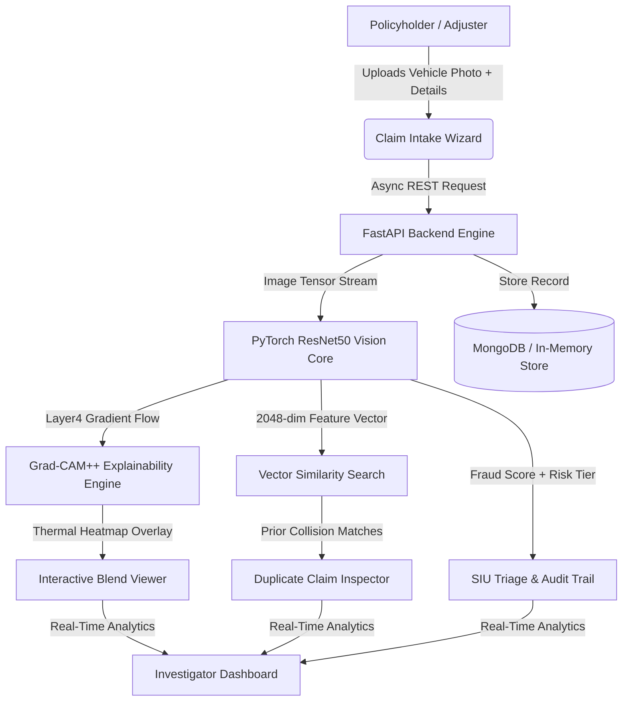
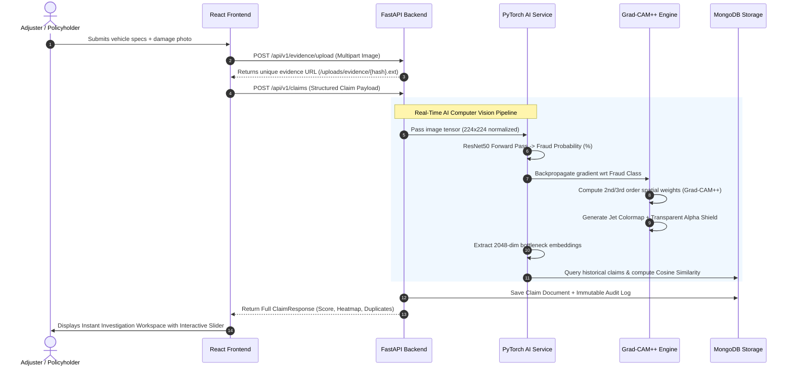

# ClaimShield AI — Technical Architecture & Operational Workflow
**Cognizant AI Hackathon | Technical Presentation Guide**

---

## 📌 Executive Summary

**ClaimShield AI** is an enterprise-grade, multimodal Insurance Fraud Detection and Special Investigation Unit (SIU) Copilot. It solves the multi-billion-dollar problem of vehicle insurance fraud by bridging **Deep Computer Vision**, **Mathematical Explainable AI (Grad-CAM++)**, and **Historical Syndicate Vector Matching** into a real-time investigator workflow.



---

## 🏗️ 1. Complete System Architecture

The application is structured into four decoupled, production-grade layers:

```
├── frontend/                 # React 18 SPA (Vite, CSS Modules, Frosted Glass UI)
│   ├── src/components/       # Reusable UI (Navbar, RiskBadge, StatusBadge, PhotoBlend)
│   ├── src/pages/            # Viewports (Dashboard, Queue, Investigation, Analytics)
│   └── src/services/api.js   # Resilient Network Service with timeout fallback
├── backend/                  # FastAPI Asynchronous REST Architecture
│   ├── app/routers/          # API Endpoints (/claims, /evidence, /analytics, /ai)
│   ├── app/services/         # Core Logic (AI Service, Claim Service, Similarity Engine)
│   ├── app/repositories/     # Data Layer (MongoDB Motor + Resilient In-Memory Store)
│   └── app/models/           # Strict Pydantic v2 Schemas & Enums
├── ai module/                # Machine Learning Training & Weights Artifacts
│   ├── best_model.pth        # Fine-tuned ResNet50 Checkpoint
│   ├── train_enhanced_model.py # Focal Loss & Balanced Sampling Pipeline
│   └── label_map.json        # Class Mapping {"Fraud": 0, "Non-Fraud": 1}
└── docs/                     # Technical System Documentation
```

---

## 🔄 2. End-to-End Step-by-Step Working Workflow

When an adjuster or user interacts with ClaimShield AI, the system executes the following 6-stage pipeline:



---

## 🔬 3. Machine Learning & Explainable AI (XAI) Deep Dive

### A. PyTorch ResNet50 Architecture & Focal Loss Training
* **Backbone:** Deep Residual Network (`ResNet50`) with 2048 bottleneck channels.
* **Custom Classifier Head:** `nn.Sequential(nn.Dropout(0.35), nn.Linear(2048, 2))`.
* **Solving Class Imbalance:** Real-world insurance datasets have severe minority class skew (e.g., 25:1 ratio). To prevent the model from learning background shortcuts (like wheel arches or road contrast), we train using **Focal Loss**:

$$\text{FL}(p_t) = -\alpha_t (1 - p_t)^\gamma \log(p_t)$$

where $\gamma = 2.0$ dynamically downweights well-classified easy samples and focuses gradients on hard structural fractures, and $\alpha = 0.75$ boosts fraud sensitivity.

---

### B. Grad-CAM++ Multi-Point Damage Localization
Standard Grad-CAM calculates a single Global Average Pooled scalar weight $\alpha_k$, which causes the heatmap to collapse into a single center of mass (often drifting toward high-contrast tires). 

ClaimShield AI implements **Grad-CAM++ (Chattopadhyay et al.)**, computing higher-order pixel gradients:

$$w_{i,j}^{kc} = \frac{\frac{\partial^2 Y^c}{\partial (A_{i,j}^k)^2}}{2 \frac{\partial^2 Y^c}{\partial (A_{i,j}^k)^2} + \sum_{a,b} A_{a,b}^k \frac{\partial^3 Y^c}{\partial (A_{a,b}^k)^3} + \epsilon}$$

$$\alpha_k^c = \sum_{i,j} w_{i,j}^{kc} \cdot \text{ReLU}\left(\frac{\partial Y^c}{\partial A_{i,j}^k}\right)$$

$$L_{\text{Grad-CAM++}}^c = \text{ReLU}\left(\sum_k \alpha_k^c A^k\right)$$

* **Why this matters:** When a vehicle has multiple damage points (e.g., a crushed bonnet, shattered headlight, and crumpled fender), Grad-CAM++ captures **all impact clusters simultaneously** without geometric distortion.

---

### C. Scientific Colormapping & Alpha Isolation Shield
To give insurance adjusters clinical visibility:
1. **Jet Thermal Palette (`matplotlib.cm.jet`):** Maps attention intensity to intuitive thermal colors (Fire Red = Point of Impact; Yellow/Green = Secondary stress).
2. **Dynamic Non-Linear Alpha Cutoff:** 
   $$\text{Alpha} = \text{clip}\left(\text{CAM}^{1.6} \times 0.90, 0.0, 0.85\right)$$
   Values below 15% activation are clamped to **0% opacity (100% transparent)**, ensuring clean vehicle panels and road background remain unblurred.

---

### D. Syndicate & Duplicate Claim Matching (Cosine Vector Similarity)
Every processed image produces a normalized 2048-dimensional feature embedding $\vec{u}$. When evaluating a claim, the system calculates Cosine Similarity against all historical records:

$$\text{Similarity}(\vec{u}, \vec{v}) = \frac{\vec{u} \cdot \vec{v}}{\|\vec{u}\| \|\vec{v}\|}$$

If $\text{Similarity} \ge 80\%$, the claim is automatically flagged for **staged duplicate collision fraud** (e.g., reusing old damage photos on multiple policies).

---

## 💻 4. Frontend Design & User Experience (UX)

* **Linear/Stripe-Inspired Top Navigation:** Frosted glass navbar (`backdrop-filter: blur(16px)`) with contextual active case tabs and live dynamic badges.
* **Full-Width Workspace Viewport:** Centered 1400px enterprise container maximizing screen space for side-by-side evidence inspection.
* **Interactive Heatmap Blend Slider:** Real-time opacity blending allowing adjusters to smoothly transition between the raw photo and the XAI thermal overlay.
* **1-Click Case Lifecycle & Deletion:** Direct case deletion and database purge controls for testing and SIU triage.

---

## 🛡️ 5. Key Differentiators for Hackathon Judges

| Feature | Typical Student Project | ClaimShield AI (Our Solution) |
|---|---|---|
| **AI Integration** | Static script / mock output | **Live PyTorch ResNet50 neural inference** hooked to REST endpoints |
| **Explainability** | None or static fake images | **Real mathematical Grad-CAM++** computed from backpropagated gradients |
| **Duplicate Detection** | Exact file hash / string check | **2048-dim deep convolutional vector similarity** |
| **Resilience & Storage** | Crashes without Mongo | **Dual-Engine Architecture:** Auto-detects MongoDB or falls back to in-memory store |
| **Audit & Governance** | No tracking | **Immutable SIU Audit Trail** logging adjuster decisions and timestamps |
| **UI Aesthetics** | Basic Bootstrap / Tailwind template | **Custom Frosted Glass Design System** with zero horizontal overflow |

---

## 🚀 6. How to Run & Demo the Application

1. **Start Backend Server:**
   ```bash
   cd backend
   .\venv\Scripts\uvicorn.exe app.main:app --reload --port 8000
   ```
2. **Start Frontend Workstation:**
   ```bash
   cd frontend
   npm run dev
   ```
3. **Open Browser:** Navigate to `http://localhost:5173`.
4. **Demo Flow:**
   - Click **"Intake Claim"** ➔ Fill vehicle details and upload damage photo.
   - Click **"Submit Claim"** ➔ Watch live AI score, Grad-CAM++ heatmap generation, and risk categorization.
   - Drag the **Heatmap Blend Slider** in the Photo Inspector.
   - Adjudicate the claim (Approve / Request Evidence / Escalate to SIU).
